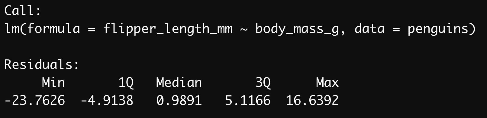
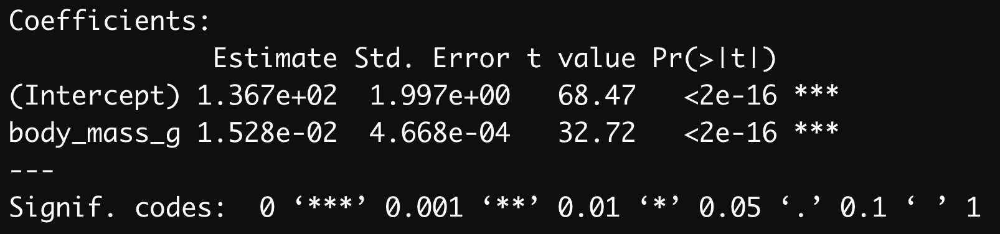

```{r setup, include=FALSE}
library(learnr)
knitr::opts_chunk$set(echo = FALSE, comment = "", fig.height = 5, fig.align = "center", out.width = "80%")
require(palmerpenguins)
require(ggplot2)
require(DAAG)
require(tidyverse)
require(kableExtra)
```

## Introduction

Much of biology is concerned with relationships between numeric variables. For example:

* We sample fish and measure their length and weight because we want to understand how weight scales with respect to length.
* We manipulate temperature and measure heart rate in humans because we want to characterise their thermal tolerance.

You already know about a technique for analysing associations between numeric variables (correlation). A correlation coefficient only quantifies the strength and direction of an association between two variables. It will be close to zero if there is no association between the variables; a strong association is implied if the coefficient is near -1 or +1. A correlation coefficient tells us nothing about the form of a relationship. Nor does it allow us to make predictions about the value of one variable from the value of a second variable. Regression, which is the focus of this section, does allow this because it involves fitting a line through the data.

In the relationships mentioned above the goal is to understand how one numeric variable depends on the values of another. Graphically, we evaluate such dependencies using a scatter plot. We may be interested in knowing:

1. Are the variables related or not? There's not much point studying a relationship that isn't there.
2. Is the relationship positive or negative? Sometimes we can answer a scientific question just by knowing the direction of a relationship.
3. Is the relationship a straight line or a curve? It is important to know the form of a relationship if we want to make predictions.

Although sometimes it may be obvious that there is a relationship between two variables from a plot of one against the other, at other times it may not. We might not be very confident in judging evidence of a positive relationship between two variables. Maybe the pattern that we perceive can just be explained by sampling variation, or maybe it can’t. Clearly it would be useful to have a measure of how likely it is that the relationship could have arisen as a result of sampling variation. In addition to judging the statistical significance of a relationship, we may also be interested in describing the relationship mathematically - i.e. finding the equation of the best fitting line through the data. A linear regression analysis allows us to do all this.

## Correlation or regression?

Whilst regression and correlation are both concerned with associations between numeric variables they are different techniques and each is appropriate under different circumstances. This is a frequent source of confusion. Which technique is required for a particular analysis depends on the way the data were collected and the purpose of the analysis. There are two broad questions to consider:

### Where do the data come from?

Think about how the data have been collected. If the data are from an experimental study where one of the variables has been manipulated, then choosing the best analysis is easy. We should use a regression analysis, in which the predictor variable is the experimentally manipulated variable and the response variable is the measured outcome. The fitted line from a regression analysis describes how the outcome variable depends on the manipulated variable - it describes the causal relationship between them.

It is generally inappropriate to use correlation to analyse data from an experimental setting. A correlation analysis examines association but does not imply the dependence of one variable on another. Since there is no distinction of response or predictor variables, it doesn't matter which way round we do a correlation. (The phrase "which way round" doesn't even make sense in the context of a correlation.)

If the data are from an observational study, either method may be appropriate. Time to ask another question:

### What is the goal of the analysis?

Think about what question is being addressed. A correlation coefficient only quantifies the strength and direction of an association between two variables, it tells us nothing about the form of a relationship. Nor does it allow us to make predictions about the value of one variable from the value of a second variable. A regression does allow this because it involves fitting a line through the data - i.e. there's a model for the relationship.

This means that if the goal of an analysis is to understand the form of a relationship between two variables, or to use a fitted model to make predictions, we have to use regression. If we just want to know whether two variables are associated or not, the direction of the association, and whether the association is strong or weak, then a correlation analysis is sufficient. It is better to use a correlation analysis when the extra information produced by a regression is not needed, because the former will be simpler and potentially more robust.


## Topic 1: Linear Regression

Linear regression models account for a straight line relationship between two numeric variables, i.e. they describe how the response variable changes in response to the values of the predictor variable. It is conventional to label the response variable as ‘y’ and the predictor variable as ‘x’. When we present such data graphically, the response variable always goes on the y-axis and the predictor variable on the x-axis. Try not to forget this convention!

How do we decide which is to be used as the response variable and which as the predictor variable? The decision is fairly straightforward in an experimental setting: the manipulated variable is the predictor variable, and the measured outcome is the response variable. Things may not be so clear cut when we are working with data from an observational study as it may not be obvious that one variable depends upon the other (in a causal sense). In regression it matters which way round we designate the response and predictor variables. If you have two variables A and B, the relationship you find from a regression will not be the same for A against B as for B against A.

Let's bring back the Palmer penguins and see how linear regression works in practice!

```{r, echo=TRUE}
penguins <- palmerpenguins::penguins
```

```{r, echo = F, warning=FALSE, message = F, out.width="70%"}
library(png)
img <- readPNG("images/penguin.png")
g <- grid::rasterGrob(img)
p <- ggplot(penguins, aes(x = body_mass_g, y = flipper_length_mm)) +
  geom_point(size = 1.5) +
  labs(x = "Body Mass (g)", y = "Flipper Length (mm)") +
  theme_classic() +
  annotation_custom(g, xmin = 5200, xmax = 6200, ymin = 175, ymax = 205) +
    theme(axis.text = element_text(size = 12),
        axis.title.y = element_text(vjust = .5, size = 20, face= "bold"),
        axis.title.x = element_text(size = 20, hjust = .5, face= "bold"))
p
m1 <- lm(flipper_length_mm ~ body_mass_g, data = penguins)
attach(penguins)
```


### Exercise: Fit a linear regression model

Write the R code required to fit a linear regression model to show the relationship between body mass (body_mass_g) and flipper length (flipper_length_mm) in penguins:

```{r create_m1, exercise=TRUE, exercise.eval=F}
m1 <- lm()
```
```{r create_m1-hint}
m1 <- lm(flipper_length_mm ~ body_mass_g, data = penguins)
```

This should look quite familiar. We have to assign two arguments:

1. The first argument is a formula. We know this because it includes a ‘tilde’ symbol: ~. The variable name on the left of the ~ should be the response variable. The variable name on the right should be the predictor variable. These are flipper length and body mass, respectively. Make sure you get these the right way round when carrying out regression.

2. The second argument is the name of the data frame that contains the two variables listed in the formula (penguins).

By inspecting the object we have created, we can view the values for the slope (_b_) and intercept (_a_). Remember that the general form of the linear model is $y = a + bx$ so these values describe the line of best fit.

```{r, echo=T}
m1
```

$$ y = a + bx$$
$$ \textrm{Flipper Length} = 136.73 + 0.015 \times \textrm{Body Mass}$$

### Exercise: Plot your model

Now plot the relationship using the function __abline()__. You can pass your intercept and slope directly to abline and it will plot the line for you:

```{r plot_m1, exercise=TRUE, exercise.lines = 3, exercise.eval = T, out.width="100%"}
plot(penguins$body_mass_g, penguins$flipper_length_mm)
abline()
```
```{r plot_m1-hint}
abline(136.73, 0.015)
abline(m1) #will also work!
```

Now we have a line plotted to describe our model!

## Topic 2: Interpreting a linear regression

A detailed summary of the properties of our model can be called up using the summary function.

```{r}
summary(m1)
```

This output is a little more complex than you may be used to so let's go through it piece-by-piece.

First we have the "Call" and "Residuals" sections. There's nothing much we need here so we won't dwell on it. The Call is simply the code that was used to fit the model and as long as it matches what we expect, that's all we need from it. The Residuals just gives us some summary stats about the residuals of our model (see the lecture videos for more information about residuals). Again, no need to pay much attention to these.

```{r, echo=FALSE, fig.align='center', out.width="75%", message=FALSE}
require(png)

```

The "Coefficients" section contains much more useful information.

```{r, echo=FALSE, fig.align='center', out.width="75%", message=FALSE}
require(png)

```

The "Estimate" column shows us the estimated intercept and slope of the model. We saw these earlier when we printed the fitted model object to the console.

Staying with this table, the next three columns (Std. Error, t value and Pr(>|t|)) show us the standard error associated with each coefficient, the corresponding t-statistics, and the p-values. Remember standard errors? These are a measure of the variability of the sampling distribution associated with something we estimate from a sample. We discussed these in the context of sample means. One can calculate a standard error for many different kinds of quantities, including the intercept and slope of a regression model. And just as with a mean, we can use the standard errors to evaluate the significance of the coefficients via t-statistics.

In this case, the p-values associated with these t-statistics indicate that the intercept is significantly different from zero (p < 0.001), and that the slope is significantly different from zero (p<0.001).

If you're interested in visualising what the standard error of a regression means, there is a way to plot it. The shading around the regression line here signifies the standard error.

```{r, echo=FALSE, warning=FALSE, message=FALSE}
ggplot(penguins, aes(x = body_mass_g, y = flipper_length_mm)) +
  geom_point(size = 0.5) +
  labs(x = "Body Mass (g)", y = "Flipper Length (mm)") +
  theme_classic() +
  theme(axis.text = element_text(size = 12),
        axis.title.y = element_text(vjust = .5, size = 20, face= "bold"),
        axis.title.x = element_text(size = 20, hjust = .5, face= "bold")) +
  geom_smooth(method = "lm", se = TRUE, color = "red", size = 1.5)
```

Finally, we have some vital model stats, in particular the R^2^.

```{r, echo=FALSE, fig.align='center', out.width="75%", message=FALSE}
require(png)

```

This shows the R-squared (R^2^) of our model. It tells you what proportion (sometimes expressed as a percentage) of the variation in the data is explained, or accounted for, by the fitted line. If R^2^ = 1 the line passes through all the points on the graph (all the variation is accounted for) and if R^2^ = 0 the line explains little or none of the variation in the data. The R^2^ value here is 0.76, indicating 76% of the variation is explained by this model. This is very respectable, but still indicates that there are other sources of variation which remain unexplained by the line.

We also have the F statistic which is used to calculate the p-value. This assesses the significance of the overall fit of the model.

## Topic 3: Reporting a linear regression

```{r, echo=FALSE, warning=FALSE, message=FALSE}
ggplot(penguins, aes(x = body_mass_g, y = flipper_length_mm)) +
  geom_point(size = 0.5) +
  labs(x = "Body Mass (g)", y = "Flipper Length (mm)") +
  theme_classic() +
  theme(axis.text = element_text(size = 12),
        axis.title.y = element_text(vjust = .5, size = 20, face= "bold"),
        axis.title.x = element_text(size = 20, hjust = .5, face= "bold")) +
  geom_smooth(method = "lm", se = F, color = "red", size = 1)
```

There is a significant positive relationship between body mass (g) and flipper length (mm) in the Palmer penguins (y=136.73 + 0.015x, F = 1071, d.f. = 1,340, p < 0.001).

Don’t forget to quote both degrees of freedom in the result. These are obtained from the summary information and should be given as the slope degrees of freedom first (which is always 1), followed by the error degrees of freedom.

If the results are being presented only in the text it is usually appropriate to specify the regression equation as well as the significance of the relationship as this allows the reader to see in which direction and how steep the relationship is, and to use the equation in further calculations. It may also be useful to give the units of measurement (though these should already be stated in the Methods). Often however, we will want to present the results as a figure, showing the original data and the fitted regression line. In this case, most of the statistical detail can go in the figure legend instead.

## Linear regression challenge

A plant physiologist studying the process of germination in the broad bean (_Vicia faba_) is interested in the relationship between the activity of the enzyme amylase, and the temperature at which the germinating beans are kept. As part of this work she carries out an experiment to find the relationship between glucose release (from the breakdown of starch by amylase) and temperature (over the range 2 - 20C). The data obtained from such an experiment are given in the file glucose.csv.

```{r, echo=FALSE, warning=FALSE, message=FALSE}
glucose <- read.csv("data/glucose.csv")
ggplot(glucose, aes(x = Temperature, y = Glucose)) +
  geom_point(size = 2.5) +
  labs(x = "Temperature", y = "Glucose") +
  theme_classic() +
  theme(axis.text = element_text(size = 12),
        axis.title.y = element_text(vjust = .5, size = 20, face= "bold"),
        axis.title.x = element_text(size = 20, hjust = .5, face= "bold"))
```

Is there a statistically significant relationship between temperature and glucose release (and hence, presumably, amylase activity)?

```{r Vicia, exercise=TRUE, exercise.eval=TRUE, exercise.lines = 5}
names(glucose)
```

## Topic 4: Non-linear data

Sometimes, no matter how many ritual sacrifices you make to the data gods, you collect data that isn't linear. As you know from the lecture videos, there are 2 options for how to treat non-linear data.

1. Transform to make the data linear
2. Fit a non-linear model

### Transforming Data

One way to deal with non-linear data is to run away and watch Queen's Gambit on Netflix. Another, arguably more useful way, is to use a mathematical transformation to force it to be linear.

Let's see how this works with some graphical examples. You can see on the left a line describing some data that are very clearly non-linear. In fact, these data follow a square relationship as shown in the equation on the graph. The graph on the right is exactly the same data but in this case, I have taken the square root of the equation. As you can see, the result is a clear, linear relationship.

```{r, echo=FALSE, warning=F, message=F, fig.height=4}
squared <- data.frame(x = c(1:100),
                     y = c(1:100)^2)
logged <- data.frame(x = c(1:100),
                     y = 1.1^c(1:100))
eq <- paste("y == x^2 + a")
eq2 <- paste(expression(sqrt(y)), " == x + ", expression(sqrt(a)))
g1 <- ggplot(squared, aes(x = x, y = y)) +
  geom_smooth(se = F, method = "gam", size = 2) +
  annotate("text", x = 25, y = 6000, label = eq, size = 6, parse = T) +
  labs(x = "x", y = "y") +
  theme_classic() +
    theme(axis.text.x = element_blank(),
        axis.text.y = element_blank(),
        axis.title.y = element_text(size = 24, angle = 0),
        axis.title.x = element_text(size = 24),
        axis.ticks = element_blank())
g2 <- ggplot(squared, aes(x = x, y = sqrt(y))) +
  geom_smooth(se = F, method = "gam", size = 2) +
  annotate("text", x = 25, y = sqrt(3600), label = eq2, size = 6, parse = T) +
  labs(x = "x", y = expression(sqrt(y))) +
  theme_classic() +
    theme(axis.text.x = element_blank(),
        axis.text.y = element_blank(),
        axis.title.y = element_text(size = 24, angle = 0),
        axis.title.x = element_text(size = 24),
        axis.ticks = element_blank())
cowplot::plot_grid(g1, g2, ncol = 2, nrow = 1)
```

Most importantly, when we transform the non-linear equation, we get something that looks much more like the general form of the linear equation (y = bx + a).

$$ y = x^2 + a$$
$$ \sqrt y = x + \sqrt a$$

One very common type of non-linearity in real data is logarithmic data. We can see again here that if we apply the right transformation (in this case a log transformation), we can turn a non-linear relationship into a linear one. Once we have achieved this, we can simply employ a linear regression on the transformed data.

```{r, echo=FALSE, warning=F, message=F, fig.height = 4}
logged <- data.frame(x = c(1:100),
                     y = 1.1^c(1:100))
eq <- paste("y == ax^b")
eq2 <- paste("Log(y) == Log(a) + b~Log(x)")
g1 <- ggplot(logged, aes(x = x, y = y)) +
  geom_smooth(se = F, method = "gam", size = 2) +
  annotate("text", x = 25, y = 11000, label = eq, size = 6, parse = T) +
  labs(x = "x", y = "y") +
  theme_classic() +
    theme(axis.text.x = element_blank(),
        axis.text.y = element_blank(),
        axis.title.y = element_text(size = 24, angle = 0),
        axis.title.x = element_text(size = 24),
        axis.ticks = element_blank())
g2 <- ggplot(logged, aes(x = x, y = log10(y))) +
  geom_smooth(se = F, method = "gam", size = 2) +
  annotate("text", x = 35, y = log10(3600), label = eq2, size = 4, parse = T) +
  labs(x = "x", y = expression(log10(y))) +
  theme_classic() +
    theme(axis.text.x = element_blank(),
        axis.text.y = element_blank(),
        axis.title.y = element_text(size = 18),
        axis.title.x = element_text(size = 24),
        axis.ticks = element_blank())
cowplot::plot_grid(g1, g2, ncol = 2, nrow = 1)
```

$$ y = ax^b$$
$$ log(y) = log(a) + b~log(x) $$

## Topic 5: Data transformation

Let's look at an example from the lectures. Here we have data on brain and body size in two groups of animals: Cetaceans and marsupials. Data are available in the file __Braindata.csv__

```{r}
brains <- read.csv("data/Braindata.csv", header = T)
knitr::kable(head(brains), digits = 3) %>% 
  kable_minimal(full_width = F)
```

Let's start by focusing on the marsupials.

```{r, echo=TRUE}
marsupials <- subset(brains, Order == "Marsupial")
```

We can see when we plot the data that what we have here looks both nonlinear and skewed. You can see from the plot below that both brain size and body mass are heavily skewed towards the smaller values. Similarly, the scatterplot shows the data is very clearly non-linear.

```{r, echo=FALSE, message=FALSE, out.width="100%"}
sp <- ggpubr::ggscatter(marsupials, x = "Body.size", y = "Brain.size",
                fill = "darkgreen", color = "darkgreen",
                size = 2, alpha = 0.6,
                xlab = "Body Mass (g)", ylab = "Brain Volume (ml)") +
  ggpubr::border()                                         
# Marginal density plot of x (top panel) and y (right panel)
xplot <- ggpubr::ggdensity(marsupials, "Body.size", fill = "darkgreen")
yplot <- ggpubr::ggdensity(marsupials, "Brain.size", fill = "darkgreen") +
  ggpubr::rotate()
# Cleaning the plots
yplot <- yplot + ggpubr::clean_theme() 
xplot <- xplot + ggpubr::clean_theme()
# Arranging the plot
ggpubr::ggarrange(xplot, NULL, sp, yplot, 
          ncol = 2, nrow = 2,  align = "hv", 
          widths = c(2, 1), heights = c(1, 2),
          common.legend = TRUE)
```

### Exercise: Transform non-linear variables

Log transform both variables and edit the code for the plot below to see if that helps.

```{r logging-marsupials, exercise=TRUE, exercise.eval=TRUE, excercise.lines = 5}

plot(marsupials$Body.size, marsupials$Brain.size, 
     pch = 19, col = "darkgreen")
```
```{r logging-marsupials-hint}
log10() #this function will take the log of a variable
marsupials$log.body <- log10(marsupials$Body.size) #for example
```

For the marsupial data, log transformation gives us some approxiamtely linear data and so we can use linear regression on the transformed data.

## Transformed data regression challenge

Using the transformed data on marsupial brain and body size, what is the relationship between these two variables?

```{r marsupial_brains, exercise = T, exercise.eval = T, exercise.lines = 5}
marsupials$log.brain <- log10(marsupials$Brain.size)
marsupials$log.body <- log10(marsupials$Body.size)

```

## Topic 6: Non-linear regression

From our dataset on brains, let us now look at the cetaceans.

```{r, echo=TRUE}
whales <- subset(brains, Order == "Cetacea")
```
```{r, out.width="100%", message=FALSE, warning=FALSE, fig.height=3.5}
g1 <- ggplot(whales, aes(x = Body.size, y = Brain.size)) +
  geom_point(color = "blue", size = 0.9) +
  labs(x = "Body Mass (g)", y = "Brain Volume (ml)") +
  theme_classic() +
  theme(axis.text.x = element_blank(),
        axis.text.y = element_blank(),
        axis.title.y = element_text(size = 12),
        axis.title.x = element_text(size = 12),
        axis.ticks = element_blank())
g2 <- ggplot(whales, aes(x = Body.size, y = Brain.size)) +
  geom_point(color = "blue", size = 0.9) +
  labs(x = "Log Body Mass", y = "Log Brain Volume") +
  scale_x_log10() + scale_y_log10() +
  theme_classic() +
  theme(axis.text.x = element_blank(),
        axis.text.y = element_blank(),
        axis.title.y = element_text(size = 12),
        axis.title.x = element_text(size = 12),
        axis.ticks = element_blank())
cowplot::plot_grid(g1,g2, ncol = 2, nrow = 1, 
                   labels = c("Untransformed", "Log Transformed"),
                   label_x = 0.15, label_y = 0.2, label_size = 16)
```

It's still clearly the right thing to do to apply a log transformation because it makes the distribution of the data much more manageable (by which I mean less terrifyingly skewed). But to me, it still kind of looks non-linear. So we need to fit a non-linear model.

Firstly, there are many ways to do this depending on what model you go with. I'm going to stay very general here because we're not asking you learn this in much detail. Just know that you have options and there are plenty of tutorials available to help.

### Linear model

First I'm going to fit a linear model. I suspect this is wrong but I won't know for sure until I compare it to another approach.

```{r, echo=TRUE}
m.linear <- lm(log10(Brain.size) ~ log10(Body.size), data = whales)
```

### Polynomial model

Since the relationship looks like it follows a relatively simple curve, I'm also going to fit a second order polynomial model. This is a type of model that can include $x^2$ terms as well as $x$ terms. 
$$ y = a + b_{1}x + b_{2}x^2$$

To achieve this, we can use the function poly() when we fit our model. The function takes 3 arguments. First it takes 'x' which as you know is the independent variable for our model. Next it takes 'degree' which for us is 2 because we want a second order polynomial. If we wanted higher orders (including $x^3$ and higher terms) then we could simply increase this number. Finally 'raw' tells R we want raw polynomials and not orthogonal ones. If you want to know what this means you can look it up but for our example here, it's not absolutely necessary to understand so I won't trouble you with it.

```{r, echo=TRUE, eval=FALSE}
m.example <- lm(Y ~ poly(x = X, degree = 2, raw = TRUE), data = DATA)
```

#### Exercise: Fitting a poynomial model

Modify the code for the linear model below to create a polynomial model
```{r whale_polynomial, exercise = TRUE, exercise.eval = T}
m.poly <- lm(log10(Brain.size) ~ log10(Body.size), data = whales)

```
```{r whale_polynomial-hint}
m.poly <- lm(log10(Brain.size) ~ poly(log10(Body.size), degree = 2, raw = T), data = whales)

```
```{r}
m.poly <- lm(log10(Brain.size) ~ poly(log10(Body.size), degree = 2, raw = T), data = whales)
```

## Topic 7: Interpreting non-linear regression

In the previous section, you fit two models to the cetacean data. One was linear and the other was polynomial. Now we need to evaluate these models and decide which is best.

We can look at the output of the model in the same way as we would for a linear regression. The general format is the same and is interpreted in the same way.

```{r, echo=TRUE}
summary(m.poly)
```

Here we have all terms statistically significant and a pretty good fit (R^2^ = 0.78, F~2,42~ = 74.52, p < 0.001). Compare this fit to the linear model.

```{r, echo=TRUE}
summary(m.linear)
```

```{r quiz_1}
quiz(
  question("Which features of the model output should we focus on to compare the fit? Check all that apply.",
           answer("Slope estimates"),
           answer("Model p-value"),
           answer("R-Squared", correct = TRUE, message = "The R-squared and residual standard error are both measures of model fit. Lower standard errors and higher R-squared values mean a better fitting model!"),
           answer("Residual standard error", correct = TRUE),
           answer("The median of the residuals"),
           random_answer_order = T, allow_retry = T
           )
  )
```

We can be a tad more rigorous and test which model is better. As long as we have "nested" models, we can compare them directly using ANOVA. Two models are nested if one contains all the same terms as the second model plus one extra term. Our models (shown below) are most certainly nested and so we can use 'anova'.

$$ y = a + b_{1}x$$
$$ y = a + b_{1}x + b_{2}x^2 $$

When comparing models in this way, we simply enter the two fitted model objects into the anova() function.

```{r, echo=TRUE}
anova(m.linear,m.poly)
```

The ANOVA output is familiar to you from previous workshops and you can see that here we have a significant result. What does this mean?

The ANOVA is testing if the more complicated model (the one with more terms) is a significantly better fit to the data than the simpler model. If there is no significant difference in model fit, we should prefer the simpler (more parsimonious) model.

```{r quiz_2}
quiz(
  question("How should we interpret this ANOVA result?",
           answer("The 2 models are no different and so we stick with linear regression.", message = "We have a p-value less than 0.05 so we definitely have a significant difference between our models."),
           answer("The models are significantly different and the linear model is a better fit.", message = "Close. There is a significant difference here (p < 0.01) but this actually indicates that the polynomial model is the better fit rather than the linear model."),
           answer("The models are significantly different and the polynomial model is a better fit.", correct = TRUE, message = "Exactly! Our significant result here indicates that our polynomial model is the better fit to the data. So our initial suspicions that the data are best described by a non-linear model are confirmed."),
           random_answer_order = T, allow_retry = T
           )
  )
```

## Topic 8: Plotting a non-linear regression

The final stage with any regression analysis is to plot the model on the data. This always helps with interpretation. Here's how to do that using the package ggplot2 for our polynomial model.

```{r, warning=F, message=F, echo=TRUE}
ggplot(whales, aes(log10(Body.size), log10(Brain.size))) +
  geom_point(colour = "blue") +
  stat_smooth(method = lm, formula = y ~ poly(x, 2, raw = T), se = F) +
  labs(x = "Log Body Mass", y = "Log Brain Volume") +
  theme_classic() +
  theme(axis.text.x = element_text(size = 12),
        axis.text.y = element_text(size = 12),
        axis.title.y = element_text(size = 16),
        axis.title.x = element_text(size = 16))

```


## Topic 9: Challenger

As you'll remember from video 5 of the lecture, we can use non-linear regression to predict the probability of a catastrophic failure during a shuttle launch. Let's load the data on solid rocket booster (SRB) O-ring damage. It's stored in the package DAAG.

```{r, echo=T, eval=F}
install.packages("DAAG")
challenger <- DAAG::orings
```

As you can see, we have the air temperature at launch and the numbers of O-rings damaged (Total). 

```{r, echo=F, eval=T}
challenger <- DAAG::orings
knitr::kable(head(challenger), align = "c")%>% 
  kable_minimal(full_width = F)
```

What we are interested in predicting is the probability that any given O-ring is in the "damaged" category as opposed to "not-damaged". If we take the first line of the data, we can see how this works.

```{r, echo=F, eval=T}
knitr::kable(head(challenger, 1), align = "c")%>% 
  kable_minimal(full_width = F)
```

We can see that at 53 degrees, 5 of the total of 6 O-rings were damaged. Given that we want to estimate the probability of a given O-ring being damaged based on the temperature, we actually will have to enter our dependent variable as a matrix of two columns (example shown below). The first column must be the number of successes (undamaged O-rings) and the second must be the number of failures (damaged O-rings). Our model will then be used to predict the likelihood of being in either category.

```{r, echo=F, message = F, warning=FALSE}
x <- data.frame(cbind(6-challenger$Total, challenger$Total))
x <- dplyr::rename(x, success = X1, failure = X2)
knitr::kable(head(x,3), align = "c")%>% 
  kable_minimal(full_width = F)
```

So in essence we actually want to predict a binary dependent variable (success/failure) and so we need the logistic regression (aka logit) function. To fit this function, we can use the 'glm' function in R which stands for _generalised linear model_. This function is used to fit a variety of different types of model. To select the logistic model, we need to add the argument family = "binomial". In this code, __cbind(6 - Total, Total)__ creates the 2 column matrix you saw above. everything else should be familiar.

```{r, echo=TRUE}
m.shuttle <- glm(formula = cbind(6 - Total, Total) ~ Temperature,
                 data = challenger, family = "binomial")
```

Now that we have fitted the model, we can take a look at the summary. Some of this is familiar (particularly the coefficients table) and it is interpreted in the same way as previously. Some is novel, such as the AIC (an information theory based approach to model comparison) and you shouldn't worry about that very much for now.

```{r, echo=TRUE}
summary(m.shuttle)
```

What you may notice is that there is no R^2^ or p-value for the whole model here! This is actually a complex topic beyond our remit here. There are many different ways to calculate these values and little consensus on which is best.

### Exercise: Calculate R^2^ and p-values from our logistic regression

We will calculate McFadden's pseudo-R^2^. This method is conceptually similar to linear regression and easy to do using the deviances from the output from R. Use the formula and code chunk below to calculate R^2^.

$$ R^2 = \frac{\textrm{Null deviance} - \textrm{Residual deviance}}{\textrm{Null deviance}}$$

```{r challenger_r2, exercise = T, exercise.eval = T}
```

```{r quiz_3}
quiz(
  question("What did we get for McFadden's pseudo R-squared?",
    answer("0.24", message = "Try again..."),
    answer("0.73", message = "Try again..."),
    answer("0.57", correct = TRUE),
    answer("0.89", message = "Try again..."),
    random_answer_order = T, allow_retry = T  )
)
```

Next we calculate a p-value for the fit. This also uses the deviances. We first calculate a log likelihood ratio using the formula below. 

$$ L.R. = 2\times(\textrm{Residual deviance} - \textrm{Null deviance})  $$
The possible values for this statistic follow a $\chi^2$ distribution and so to calculate our p-value, we use the function pchisq. Note that the degrees of freedom for this calculation are equal to the difference in df between the two deviance values ($22 - 21 = 1$).

Edit the code below to calculate our likelihood ratio (using the equation above) and derive a p-value from it.

```{r challenger_p, exercise = T, exercise.eval = F}
LR <- 2()
pchisq(LR, df = 1)
```

If you've followed the equations, you should have a p-value estimated around 0 and R^2^ of 0.57.

## Topic 10: Using regression for prediction

Let's not lose sight of why we're doing this. We wanted to make a decision about launching the space shuttle Challenger on January 28^th^ 1986. Let's visualise our regression model by plotting it over the data. To do so, I'm going to take the fitted values from the model and add them to our data. Remember that these are just the predicted values and so they should all fall exactly along the curve of our model.

```{r, echo=TRUE}
challenger$fitted <- 1 - m.shuttle$fitted.values
```
```{r}
knitr::kable(head(challenger), digits = 3, align = "c") %>% 
  kable_minimal(full_width = F)
```

We can now plot the curve using these values. Here's how to do this in base graphics if you don't like using ggplot. It has the advantage that the code is relatively simple but it's not as attractive. This is just a personal judgement and different people can disagree about this. Edit the options in this code to see how it works.

```{r challenger_plot, exercise = T, exercise.eval = T}
plot(Total/6 ~ Temperature, data = challenger, xlab = "temperature (F)",
     ylab = "Probability of damage", ylim = c(0, 1),
     pch = 19, col = "orange")
lines(challenger$fitted ~ challenger$Temperature)
```

As you may know, the temperature that morning was 31 degrees, significantly lower than any previous launch and therefore outside of our established database. We will need to extend our model. We can use the function 'predict()' to do exactly this. predict() gives us our logit-transformed probability.

```{r, echo=TRUE}
predict(m.shuttle, newdata = data.frame(Temperature = 31))
```

We can transform this back into a probability by applying the inverse logit function.

$$ \frac{1}{1 + e^{-p~\textrm{logit}}}$$

```{r, echo=TRUE}
lp <- predict(m.shuttle, newdata = data.frame(Temperature = 31))
p <- 1/(1 + exp(-lp))
p
```

Note that this is the probability of success! It might make more sense in this case to look at the probability of failure because we want to make our results easily interpretable. 

$$ P_{(\textrm{Fail})} = 1 - P_{(\textrm{success})}$$

```{r, echo=TRUE}
1 - p
```

There we have it. Our model predicts a 99.3% chance of damaged O-rings at 31 degrees. Launching is definitely a bad idea.

## Topic 11: Saving the Challenger

As one final step, let's project our graphical model out to cover the whole range of temperatures. 

First we create a new dataframe of temperatures from 25 to 85 and calculate the predicted values using predict just as before. Note that this time I'm using the "1-" in predict so I won't have to do it later. It's exactly the same reasoning as before (we're looking at failure rather than success here).

```{r, echo=TRUE}
fitteddata <- data.frame(Temperature = c(25:85),
                         fitted = 1 - predict(m.shuttle, type = "response", 
                         newdata = data.frame(Temperature = 25:85)))
```

When we plot the new extrapolated data, we can see clearly why Challenger ran into problems. The temperature and probability of failure of the launch is plotted in red. The extension of our model is plotted as a dashed line.

```{r, echo=F, warning=F, message = F}
ggplot(challenger, aes(x = Temperature, y = Total/6)) +
  geom_point(size = 2.25, colour = "orange") +
  ylim(c(0,1)) + xlim(25,82) +
  labs(x = "Temperature (F)", y = "Proportion of damaged O-rings") +
  theme_classic() +
  theme(axis.text.x = element_text(size = 10),
        axis.text.y = element_text(size = 10),
        axis.title.y = element_text(size = 16),
        axis.title.x = element_text(size = 16)) +
  geom_smooth(data = fitteddata, mapping = aes(x = Temperature, y = fitted), 
              se = F, method = "gam", size = 1, lty = 2)+
  geom_smooth(mapping = aes(x = Temperature, y = fitted), 
              data = challenger, se = F, method = "gam",
              size = 2) +
  geom_point(aes(x = 31, y = 0.993), size = 3, col = "red") +
  annotate("text", 31, .94, label = "Proposed Launch", color = "red")
```

```{r,echo=FALSE, fig.align='center', out.width="100%", message=FALSE}
require(png)

```
