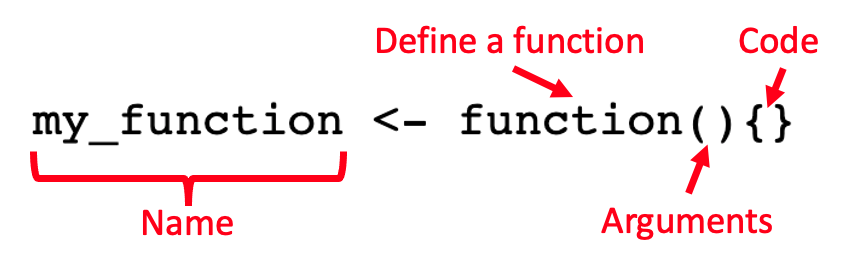

```{r setup, include=FALSE}
library(learnr)
knitr::opts_chunk$set(echo = FALSE, comment = "", fig.height = 5, fig.align = "center", out.width = "80%")
library(ggplot2)
library(ggambit)
library(rchess)
```

## Introduction

Many of the things you do with R can be completed using existing packages and functions. In fact for many, one of the biggest challenges is simply finding the correct package and/or function for what they need.

Sometimes, it can be useful to know how to write your own function for specific tasks. It can also be useful to understand this when troubleshooting why a function doesn't work.

## Topic 1: A very basic function

Let's write a very basic function just so we can look at the syntax. You can see here that we need four main elements.

```{r, echo = FALSE, eval=TRUE, out.width="90%"}

```

The most important parts here are the arguments and the code. The arguments will be what the user provides to the function when using it. The code will contain everything that R runs on the arguments provided to it.

Let's create a function to calculate the mean of a list of numbers. The mean is simple to calculate using the formula:

$$ \mu = \frac{\sum x}{N}$$
So within our code section, we need to write some code that will take the sum of all the numbers and divide it by the length of the list of numbers. Try this out in the window below

```{r fun1, exercise = TRUE, eval.exercise = FALSE}
my_function <- function(x){}
```
```{r fun1-hint}
my_function <- function(x){
  sum(x)/length(x)
}
```

Once the function is defined, we can use it!

```{r, echo=FALSE}
my_function <- function(x){
  sum(x)/length(x)
}
```
```{r, echo=TRUE}
my_function(x = c(5,6,7,8,9))
```


## Creating a Chess playing function

Chess is an ancient Indian game that was adapted into its modern form in medieval Europe. One of the most interesting things about this game is that there is no such thing as "perfect" play. There is no strategy you can memorise that will mean you cannot lose. Even now that computers can play chess at least as well and even better than humans, the game of chess is still not "solved". This has meant that it has maintained its allure across centuries and to this day, many people are still fascinated by the game. 

If you'd like to learn a little more about the culture of chess in recent times, I strongly recommend _The Queen's Gambit_, a drama series on Netflix. The series is based on a novel written about a fictionalised version of an American chess prodigy named Bobby Fischer. However, please do not come away with the idea that drug and alcohol addiction or any form of mental illness will give you impressive mental abilities. This is, and I cannot stress this enough, __nonsense__.

As a game, chess is almost impossibly simple. Anyone can pick up the rules in a matter of minutes. However, the complexities of strategy and the infinite possibilities on the board continue to confound even the greatest players. In this tutorial, we will use chess as a way to build your experience with writing functions in R.

To help R understand the rules of chess, we can install the __rchess__ package. I'll also install the __ggambit__ package to help us visualise chess positions.
```{r, echo=TRUE, eval=FALSE}
install.packages("rchess")
library(rchess)
devtools::install_github('cj-holmes/ggambit')
library(ggambit)
```

```{r}
g <- Chess$new()
plot_fen(g$fen(), show_fen = FALSE)
```

## An introduction to chess notation

The first problem we have to deal with is how to get R to understand a chess position. For this, we'll be using the Forsyth-Edwards Notation (FEN). This is a universal method for describing a chess position. First comes the positions of the pieces, then who's turn it is (_w_), the posibility of castling is next (_KQkq -_). After that, the position of any _en passant_ target squares are noted, followed by the halfmove clock (1) and the fullmove clock (3).

If you don't understand some of this don't worry. Castling and _en passant_ are special moves in chess and the clock just keeps track of how many moves have happened. Let's view the FEN for the standard chess starting position.

```{r, echo=T}
g <- Chess$new()
g$fen()
```

Little more than a string of characters to the uninitiated but with a little chess experience, you'll be able to extract some meaning from strings like this. In the meantime however, I don't see the point in trying to read the raw data like this so let's plot it in a more familiar form. Using the __ggambit__ package, we can do just this.

```{r, echo=T}
plot_fen(g$fen())
```

## Topic 2: Playing Chess against R

```{r, echo=F}
plot_fen(g$fen())
```

The first step in any chess game is to make an opening move! We're playing white here so we have the first move. We can generate a list of possible moves to choose from. The function moves() can list all the moves from the current position. 
```{r, echo=TRUE}
g$moves()
```

Let's go with a classic king's pawn opening. The notation to describe this move is __e4__ as we are moving the pawn to the square e4. We can take our move straight from the list and use the function move() to advance the game.

```{r, echo=TRUE}
g$move("e4")
plot_fen(g$fen())
```

A strong start. Now we'd like to have the computer respond to our move. Let's have our virtual player select a move at random. We can sample the moves using __sample__. When we extract this move, we'll assign it it's own object _x_ so that we can feed it back in as the computer's move. You may get a different move with your sample.
```{r, echo=TRUE, eval=FALSE}
g$moves()
x <- sample(g$moves(), 1)
```

```{r, echo=FALSE}
g$moves()
x <- "h6"
```

```{r}
x
```

Now we can feed our opponent's move into the game using the same function as before.

```{r}
g$move(x)
plot_fen(g$fen(), show_fen = FALSE)
```

Now we can respond with our own move in the same way.

```{r, echo=TRUE}
g$move("Nf3")
plot_fen(g$fen(), show_fen = FALSE)
```

We can streamline the method of choosing the next Black move by putting the sample function inside the move function. (You can also do this kind of thing with piping by the way!)

```{r, echo=TRUE, eval=FALSE}
g$move(sample(g$moves(), 1))
```

```{r, echo=FALSE}
x <- "e5"
g$move(x)
plot_fen(g$fen(), show_fen = FALSE)
```

We have an opportunity here. We can take Black's king pawn with our knight. The notation to take a piece is "x". In this case, the move would be Nxe5 (Knight to take on e5).

```{r chess1, exercise=TRUE, exercise.eval = TRUE}
#Enter your move here and run the following code
#g$move("")
plot_fen(g$fen(), show_fen = FALSE)
```
```{r chess1-hint}
g$move("Nxe5")
```

## Topic 3: Streamlining your code with functions

So far, we've managed to play a reasonable game of chess against the computer but we're typing a lot of repetitive code. This is a perfect opportunity to write a function that simplifies the whole process.

We will call our function __play.chess__ because it's good to go with something simple and informative. Inside the brackets of function(), we will specify what arguments we will submit to the final function. To play chess we'll need two things.
1. Our move
2. The current state of the game

```{r, echo = TRUE, eval=F}
play.chess <- function(move, game){}
```

For the first thing our function does, we need to get our function to make the move we have specified. We can do this by adding code that we already know.

We can add some code at the end of the function using __return__ to tell R what we want the final product to be. Here we want position (which we've been calling __g__) and a plot of the final position which we will call __board__.

```{r, eval=F, echo=TRUE}
play.chess <- function(move, game){
  g <- game # assigns the starting position a name
  g$move(move) # makes our move from the position g
  
  return(list(game = g,
              board = plot_fen(g$fen(), show_fen = FALSE)))
}
```

This only really does the same as the __g$move()__ function we used earlier. To really make this a function that plays chess, we need to make it select a move. Using the code you've already come across, add a line to the function that will select a move at random.

```{r chess2, exercise = TRUE, exercise.eval = FALSE}
play.chess <- function(move, game){
  g <- game # assigns the starting position a name
  g$move(move) # makes our move from the position g
  #ENTER CODE HERE # play a randomly selected move

  return(list(game = g,
              board = plot_fen(g$fen(), show_fen = FALSE)))
}
```
```{r chess2-hint}
play.chess <- function(move, game){
  g <- game # assigns the starting position a name
  g$move(move) # makes our move from the position g
  g$move(sample(g$moves(), 1)) # play a randomly selected move

  return(list(game = g,
              board = plot_fen(g$fen(), show_fen = FALSE)))
}
```

```{r simple chess function, echo=FALSE, eval=TRUE}
play.chess <- function(move, game){
  g <- game # assigns the starting position a name
  g$move(move) # makes our move from the position g
  g$move(sample(g$moves(), 1)) # play a randomly selected move

  return(list(game = g,
              board = plot_fen(g$fen(), show_fen = FALSE)))
}

```

### Testing our function

Let's take it for a spin!

```{r, echo=TRUE, eval=TRUE}
test.game <- play.chess(move = "e4", game = Chess$new())
test.game$board
```

Here we can see that we have made our opening move and the computer has responded. Now we can run the function again with our next move, remembering to pass the previous game state as our new starting point.

```{r, echo=TRUE, eval=TRUE}
test.game <- play.chess(move = "Nf3", game = test.game$game)
test.game$board
```

## Topic 4: If statements

So far our function takes our move and then produces a response. This is ok for the very beginning but we need to build in some more complexity to our function. For example, we need our function to be able to tell if the game is over. In other words, we need to check if a given position is a checkmate or draw.

Let's take a simple example.

```{r}
g2 <- Chess$new("rnb1kbnr/pppp1ppp/8/4p3/5PPq/8/PPPPP2P/RNBQKBNR w KQkq - 1 3")
plot_fen(g2$fen(), show_fen = FALSE)
```

Looks dire for white. A human who understands the rules of chess can immediately see the state of this game. It's not always so obvious (either to humans or machines) so we can use simple functions to check the state of the game. These both return TRUE or FALSE and we'll need those in our function later.

```{r, echo=TRUE}
g2$in_check()
g2$in_checkmate()
```

Yep, this game is over. In fact, white has succumbed to the _fool's mate_ and been defeated in only two moves.

### Stalemates & draws

There are other ways a chess game can end. When humans play, they offer each other draws in certain positions that are likely to end in stalemates. For our function, we'll just evaluate positions that are actually stalemates and leave the foresight to the true chess players.

```{r, echo=FALSE}
g3 <- Chess$new("4k3/4P3/4K3/8/8/8/8/8 b - - 0 78")
plot_fen(g3$fen(), show_fen = FALSE)
```

```{r, echo=TRUE}
g3$in_stalemate()
```

Another game that has run to its conclusion. In a stalemate, the player whose turn it is cannot make a legal move. In this case, black cannot move her only piece without putting it in check from white's pawn or king. This is a draw.

Another way in which a game can end is _Insufficient Material_. This means that neither side has enough material strength to force a checkmate. In the example below, any check black could create could be escaped by white. At this point, usually players agree on a draw.

```{r, echo=FALSE}
g5 <- Chess$new("k7/8/n7/8/8/8/8/7K b - - 0 1")
plot_fen(g5$fen(), show_fen = FALSE)
```
```{r, echo=TRUE}
g5$insufficient_material()
```

If we want to play chess against R, we need to check these things all the time. Skilled players who have played chess for years are doing this all the time. It's almost second nature to them. Inexperienced human players may miss these features of the game. Furthermore, a computer player needs these rules explained to it so it can check for the state of the game. Fortunately, we can instruct the computer to check for us using the functions provided in the package!

### If statements

An if statement essentially gives the computer two options for how to proceed based on a condition. Let's see how it works by adding it to our chess function. We want the function to evaluate if the game is over and if it is, stop playing. If the game isn't over, the function should choose a move.

Fortunately, __rchess__ has a function to check if the game is over.
```{r, eval=FALSE, echo=TRUE}
play.chess <- function(move, game){
  g <- game 
  g$move(move) 
  
  if(g$game_over() != "TRUE"){      # If the game is not over 
    g$move(sample(g$moves(), 1))# sample a random move and play it
  }
  
  return(list(game = g,
              board = plot_fen(g$fen(), show_fen = FALSE)))
}

```

We might also want the function to report some things to us. In the exercise below, embed some if statements to report messages (use the message() function) in the event that the game is over after each move.

```{r messages, exercise = TRUE, exercise.eval = FALSE}
play.chess <- function(move, game){
  g <- game 
  g$move(move) 
  
  if(g$game_over() != "TRUE"){      # If the game is not over 
    g$move(sample(g$moves(), 1))# sample a random move and play it
  }
  
  return(list(game = g,
              board = plot_fen(g$fen(), show_fen = FALSE)))
}
```
```{r messages-hint}
play.chess <- function(move, game){
  g <- game 
  g$move(move) 
  
 if(g$in_checkmate()=="TRUE") message("Checkmate: You win!")
 if(g$in_stalemate()=="TRUE") message("Stalemate")
 if(g$insufficient_material()=="TRUE") message("Insufficient Material")

  if(g$game_over() != "TRUE"){      # If the game is not over 
    g$move(sample(g$moves(), 1))# sample a random move and play it
   
   if(g$in_checkmate()=="TRUE") message("Checkmate: You lose!")
   if(g$in_stalemate()=="TRUE") message("Stalemate")
   if(g$insufficient_material()=="TRUE") message("Insufficient Material")
  }
  return(list(game = g,
              board = plot_fen(g$fen(), show_fen = FALSE)))
}

```

```{r}
play.chess <- function(move, game){
  g <- game 
  g$move(move) 
 if(g$in_checkmate()=="TRUE") message("Checkmate: You win!")
 if(g$in_stalemate()=="TRUE") message("Stalemate")
 if(g$insufficient_material()=="TRUE") message("Insufficient Material")
  if(g$game_over() != "TRUE"){      # If the game is not over 
    g$move(sample(g$moves(), 1))# sample a random move and play it
   if(g$in_checkmate()=="TRUE") message("Checkmate: You lose!")
   if(g$in_stalemate()=="TRUE") message("Stalemate")
   if(g$insufficient_material()=="TRUE") message("Insufficient Material")
  }
  return(list(game = g,
              board = plot_fen(g$fen(), show_fen = FALSE)))
}
```

## Playing Chess

The true test of any function is to use it so let's do that!

```{r, echo=TRUE, eval = T}
move1 <- play.chess("e4", Chess$new())
move1$board
```

Let's make some more moves, playing a predetermined opening sequence.

```{r, echo=TRUE}
move2 <- play.chess("Nf3", move1$game)
move3 <- play.chess("d3", move2$game)
move4 <- play.chess("h3", move3$game)
move5 <- play.chess("c3", move4$game)
```

```{r, out.width="100%", fig.height=8}
cowplot::plot_grid(move2$board, move3$board, 
                   move4$board, move5$board, 
                   nrow = 2, ncol = 2, 
                   labels = c("Move 2", "Move 3",
                              "Move 4", "Move 5"))
```

You can go on like that until the game concludes or until you get bored. Remember that your opponent is choosing legal moves randomly and so is unlikely to present a significant challenge.

The key point to take away from what we did here is the use of _if_ statements. We embedded them into the function to allow the computer to respond flexibly based on the circumstances. This is the first step to creating code that will respond logically given a set of circumstances. In any case, there you have it! Your first computer chess player.

## Topic 5: Improving your chess player

So our player is currently picking moves at random which is an incredibly poor strategy for chess. Let's see if we can give them a personality.

### Go for the win

A simple addition to our code will make the player take a checkmate option if it is available. Note that a checkmate move is denoted by a '#' in chess notation.

Within this function, I have embedded the ability to search for a checkmate move and play it.

```{r, echo=TRUE}
play.chess <- function(move, game){
  g <- game 
  g$move(move) 
 if(g$in_checkmate()=="TRUE") message("Checkmate: You win!")
 if(g$in_stalemate()=="TRUE") message("Stalemate")
 if(g$insufficient_material()=="TRUE") message("Insufficient Material")
  if(g$game_over() != "TRUE"){
    
   #These lines will search the legal moves for a #
   substring="#"
   string_vector=g$moves()
   moves <- as.data.frame(grepl(substring,string_vector))
   moves[,2] <- g$moves()
   moves <- subset(moves, moves[,1] == "TRUE")
   
   #If it doesn't find one, it's back to random selection 
   #but if it does these lines will make the move
   if(length(moves[,1]) == 0){
        g$move(sample(g$moves(), 1))
   } else{
     g$move(sample(moves[,2], 1))
   }
    
   if(g$in_checkmate()=="TRUE") message("Checkmate: You lose!")
   if(g$in_stalemate()=="TRUE") message("Stalemate")
   if(g$insufficient_material()=="TRUE") message("Insufficient Material")
  }
  return(list(game = g,
              board = plot_fen(g$fen(), show_fen = FALSE)))
}

```

### Aggressive

In chess, one possible strategy is to focus on material and try to gain an advantage by having more pieces than your opponent. We can instill a simple version of this strategy by making our player take a piece at every opportunity! In chess notation, taking a piece is denoted by x so now we can add some lines to get the command to list all commands that contain an x.

```{r, echo=TRUE}
play.chess.aggresive <- function(move, game){
 
  g <- game  
  g$move(move) #makes our move

 if(g$in_checkmate() == "TRUE") message("Checkmate: You win!")
 if(g$in_stalemate() == "TRUE") message("Stalemate")
 if(g$insufficient_material() == "TRUE") message("Insufficient Material")
 
 if(g$game_over() != "TRUE"){
  
   substring="#"
   string_vector=g$moves()
   win.moves <- as.data.frame(grepl(substring,string_vector))
   win.moves[,2] <- g$moves()
   win.moves <- subset(win.moves, win.moves[,1] == "TRUE")

   #Let's repeat the process and search for any taking moves
   substring="x"
   take.moves <- as.data.frame(grepl(substring,string_vector))
   take.moves[,2] <- g$moves()
   take.moves <- subset(take.moves, take.moves[,1] == "TRUE")
   
   #If the command finds some taking moves (there may be more than one),
   #these lines will first see if there's a checkmate, and if not, then
   #take a piece if possible by sampling from the list of possible taking
   #moves. If not, it's random selection once again.
   if(length(win.moves[,1]) > 0){
     g$move(sample(win.moves[,2], 1))
   } else {
     if(length(take.moves[,1]) == 0){
      g$move(sample(g$moves(), 1)) 
     } else {
       g$move(sample(g$moves(), 1))
     }
   }

   if(g$in_checkmate() == "TRUE") message("Checkmate: You lose!")
   if(g$in_stalemate() == "TRUE") message("Stalemate")
   if(g$insufficient_material() == "TRUE") message("Insufficient Material")
 }

 return(list(game = g,
             board = plot_fen(g$fen(), show_fen = FALSE)))
}

```

This new player is recklessly aggressive and you can manipulate their moves by offering up sacrifices.

As you can see, we can begin to build up the complexity of our player. You'll need much more complex code than this to replicate a human player.

### Coding Challenge

Take some time to dissect the functions above and see how they search through the possible moves. Then, edit them to see if you can produce a player with a better strategy.

Perhaps you could create a player that changes strategy depending on the clock that tracks the number of moves. Or perhaps you could prioritise certain pieces or positions over others.

